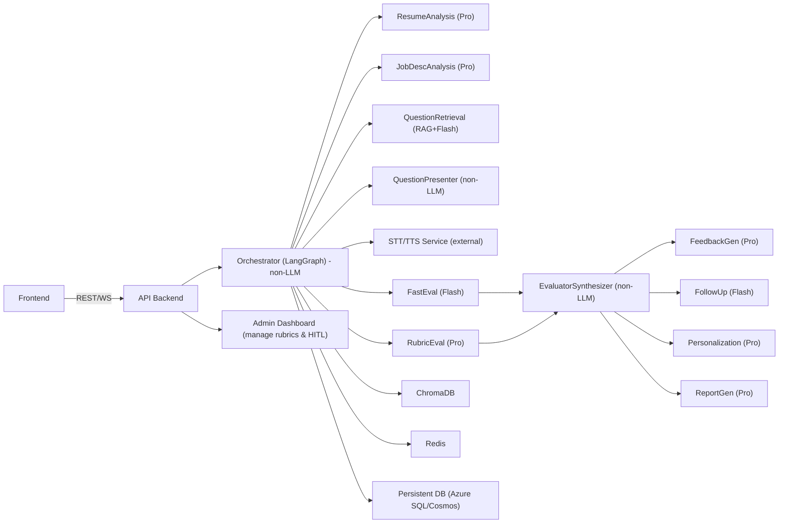

# Multi-Agentic RAG Interview System

This project is a cloud-hosted mock-interview platform that uses a LangGraph orchestrator to coordinate 9 LLM agents. This document contains the complete Phase-1 plan, architecture, and setup instructions.

## Getting Started

Follow these instructions to set up your local development environment.

### Prerequisites

- Python 3.11
- Git

### 1. Clone the Repository

First, clone the project from GitHub to your local machine:

```bash
git clone <YOUR_GITHUB_REPOSITORY_URL>
cd multi-agentic-rag-system
```

### 2. Install UV

This project uses `uv` for high-performance package management. If you don't have it installed, run the following command. This only needs to be done once.

```bash
pip install uv
```

### 3. Create the Virtual Environment

Use `uv` to create a local virtual environment for the project. This command will create a `.venv` folder in the project root.

```bash
uv venv -p 3.11
```

### 4. Install Dependencies

Install all the required Python packages for the project using `uv`. This command reads the `pyproject.toml` file and installs everything, including development tools.

```bash
uv pip install -e ".[dev]"
```

### 5. Set Up Environment Variables

Create a `.env` file in the root of the project by copying the example file:

```bash
# For Windows (PowerShell)
copy .env.example .env

# For macOS/Linux
cp .env.example .env
```

Now, open the `.env` file and add your necessary API keys (like `GOOGLE_API_KEY`, etc.).

### 6. Run the Application

You can now start the FastAPI server:

```bash
uvicorn interview_system.api.main:app --reload
```

The application will be running at `http://127.0.0.1:8000`.

---

## Project Structure

### Backend Application Structure

```
multi-agentic-rag-system/
│
├── .env                    # --- Environment variables (API keys, DB connections)
├── .gitignore              # --- Files to ignore in version control
├── docker-compose.yml      # --- Services for local development (DB, Redis, etc.)
├── Dockerfile              # --- Main application container build instructions
├── pyproject.toml          # --- Project dependencies and metadata (Poetry/PDM)
├── README.md               # --- High-level project documentation
│
├── scripts/                # --- Standalone operational/maintenance scripts
│   ├── __init__.py
│   └── seed_database.py    # --- Example: Populate DB with initial questions/rubrics
│
├── src/                    # --- Main application source code
│   └── interview_system/
│       ├── __init__.py
│       ├── logging_config.py   # --- Centralized structured logging configuration
│       │
│       ├── agents/             # --- Logic for each of the 9 individual LLM agents
│       │   ├── __init__.py
│       │   ├── resume_analyzer.py
│       │   ├── job_description_analyzer.py
│       │   ├── question_retrieval.py
│       │   ├── fast_eval_agent.py
│       │   ├── rubric_eval_agent.py
│       │   ├── feedback_generator.py
│       │   ├── follow_up_agent.py
│       │   ├── personalization_agent.py
│       │   └── report_generator.py
│       │
│       ├── api/                # --- FastAPI application, routers, and dependencies
│       │   ├── __init__.py
│       │   ├── main.py         # --- FastAPI app startup and middleware
│       │   └── routers/
│       │       ├── __init__.py
│       │       ├── interview.py  # --- Endpoints for managing interview sessions
│       │       └── admin.py      # --- Admin endpoints for HITL and rubric management
│       │
│       ├── auth/               # --- Authentication & user management logic
│       │   ├── __init__.py
│       │   ├── dependencies.py   # --- FastAPI security dependencies (e.g., get_current_user)
│       │   ├── jwt_utils.py      # --- JWT token creation and verification logic
│       │   ├── password_utils.py # --- Password hashing and validation
│       │   └── router.py         # --- Auth endpoints: /register, /login, /refresh
│       │
│       ├── config/             # --- Application config split by domain
│       │   ├── __init__.py
│       │   ├── app_config.py
│       │   ├── auth_config.py
│       │   ├── db_config.py
│       │   └── llm_config.py
│       │
│       ├── models/             # --- Database models (e.g., SQLAlchemy ORM)
│       │   ├── __init__.py
│       │   ├── base.py
│       │   ├── user.py
│       │   ├── session.py
│       │   ├── question.py
│       │   └── rubric.py
│       │
│       ├── orchestration/      # --- LangGraph state, nodes, and graph definition
│       │   ├── __init__.py
│       │   ├── graph.py        # --- Graph nodes, edges, and routing logic
│       │   └── state.py        # --- Pydantic/TypedDict schemas for session state
│       │
│       ├── prompts/            # --- Prompt templates (e.g., Jinja2 files)
│       │   ├── __init__.py
│       │   └── ...
│       │
│       ├── rag/                # --- Retrieval-Augmented Generation pipeline
│       │   ├── __init__.py
│       │   ├── pipeline.py
│       │   └── retriever.py
│       │
│       ├── repositories/       # --- Data access layer (abstracts DB operations)
│       │   ├── __init__.py
│       │   ├── user_repository.py
│       │   └── session_repository.py
│       │
│       ├── schemas/            # --- Pydantic models for API/data validation
│       │   ├── __init__.py
│       │   ├── agent_outputs.py
│       │   ├── user.py
│       │   └── interview.py
│       │
│       └── services/           # --- Wrappers for external services
│           ├── __init__.py
│           ├── vector_store.py # --- ChromaDB client
│           ├── cache.py        # --- Redis client
│           └── llm_clients.py  # --- Gemini Flash & Pro clients
│
└── tests/                  # --- Automated tests
    ├── __init__.py
    ├── integration/
    └── unit/
        ├── agents/
        ├── api/
        ├── auth/
        └── orchestration/
```

### Frontend Application Structure

```
frontend/
│
├── public/                 # --- Static assets (index.html, icons, images)
├── src/                    # --- Frontend source code (React/Vue/etc.)
│   ├── api/                # --- Functions for calling the backend API
│   ├── assets/             # --- Images, fonts, etc.
│   ├── components/         # --- Reusable UI components (e.g., Button, ChatWindow)
│   ├── hooks/              # --- Custom hooks (e.g., useAuth)
│   ├── pages/              # --- Top-level page components (e.g., InterviewPage, AdminDashboard)
│   ├── services/           # --- State management logic (e.g., Redux, Zustand)
│   ├── styles/             # --- Global CSS, SASS/SCSS files
│   └── App.jsx             # --- Main application component
│
├── package.json            # --- Node.js project dependencies and scripts
└── vite.config.js          # --- Build tool configuration (or similar)
```

---

## Core Project Details (For AI Prompts)

Use the following section as a consistent context when interacting with AI assistants for this project.

### Multi-Agentic RAG Interview System — Complete Phase-1 Plan

- **Architecture:** 9 LLM agents + 1 non-LLM Orchestrator (LangGraph).
- **Models:** Gemini 2.5 Flash (fast calls) & Gemini 2.5 Pro (deep calls).

### Executive Summary

Build a cloud-hosted mock-interview platform that uses a LangGraph orchestrator to coordinate 9 LLM agents (parsing, retrieval, evaluation, feedback, personalization, report generation) and one deterministic Orchestrator that routes, slices the canonical session state for each agent, parallelizes evaluation, enforces quotas, and persists snapshots. Use ChromaDB for RAG, Redis for session/cache/locks, Azure Blob for media, and Azure SQL/Cosmos for persistent metadata. Prioritize near-instant UX with Flash for speed-critical paths and Pro for accuracy-critical evaluation and final synthesis. Include an admin dashboard and rubric management in Phase 1 so HITL flows work out of the box.


### Top-Level Component Map

**Text:**

Frontend (Streamlit/React) -> Backend API (FastAPI) -> Orchestrator (LangGraph) — non-LLM -> LLM Agents (9) — resume/job parsing, question retrieval (RAG + Flash fallback), follow-up, fast eval, rubric eval, feedback, personalization, report -> Services: ChromaDB (vector DB), Redis, Azure SQL/CosmosDB, Azure Blob Storage, STT/TTS, Monitoring, Admin Dashboard.

**Mermaid:**



### Clear Separation: LLM Agents vs. Non-LLM Orchestrator

**Non-LLM (Deterministic):**

- Orchestrator (LangGraph node graph + Python code)
- QuestionPresenter (formatting/tts trigger)
- EvaluatorSynthesizer (merge fast+rubric outputs)
- Simple business rules (AdaptiveDifficulty logic)

**LLM Agents (9):** Each returns JSON/Pydantic outputs:

1.  **ResumeAnalysisAgent** — Gemini 2.5 Pro
2.  **JobDescAnalysisAgent** — Gemini 2.5 Pro
3.  **QuestionRetrievalAgent** — ChromaDB retrieval + Gemini 2.5 Flash fallback for generation
4.  **FastEvalAgent** — Gemini 2.5 Flash
5.  **RubricEvalAgent** — Gemini 2.5 Pro
6.  **FeedbackGenAgent** — Gemini 2.5 Pro
7.  **FollowUpAgent** — Gemini 2.5 Flash
8.  **PersonalizationAgent** — Gemini 2.5 Pro
9.  **ReportGenAgent** — Gemini 2.5 Pro

_Note: `AdminQuestionReview` can be a UI with optional LLM suggestions (Flash) but the dashboard itself and approval logic are non-LLM._

### Rationale for Model Assignments (Short)

- **Flash (Gemini 2.5 Flash):** Low latency, used for user-facing quick interactions: question generation fallback, quick evaluations, follow-ups.
- **Pro (Gemini 2.5 Pro):** Higher reasoning and consistency for parsing resumes, job descriptions, rubrics, feedback synthesis, personalization, and final report.

### Canonical Session State & Selector Pattern (Essential)

**Principle:** The Orchestrator stores the full `SessionState` but passes only the minimum slice each agent needs. This avoids token bloat and keeps agents testable.

**SessionState (Pydantic sketch):**

```python
class QuestionTurn(BaseModel):
    question_id: Optional[str]
    question_text: str
    ideal_answer_snippet: Optional[str]
    answer_text: Optional[str]
    answer_audio_ref: Optional[str]
    evals: Optional[Dict[str, Any]]  # fast and rubric outputs
    feedback: Optional[Dict[str, Any]]
    timestamp: datetime

class SessionState(BaseModel):
    session_id: UUID
    user_id: UUID
    resume_summary: Optional[dict]
    job_summary: Optional[dict]
    question_history: List[QuestionTurn] = []
    current_question: Optional[QuestionTurn]
    personalization_profile: Optional[dict]
    created_at: datetime
    updated_at: datetime
```

**Example Selector Rules:**

- `FastEval` input = `{ question_text, answer_text, ideal_answer_snippet }`
- `RubricEval` input = `{ question_text, answer_text, rubric_schema, ideal_answer_snippet }`
- `FeedbackGen` input = `{ merged_evaluation, last_n_turns_summary, personalization_profile }`

Implement `select_input_for(agent_name, session_state)` in Orchestrator.

### Pydantic Contracts & Sample JSON Outputs (For Every Agent)

Below are minimal JSON outputs each agent must return. Use these Pydantic schemas in code to validate LLM responses.

**ResumeAnalysisAgent Output (Example):**

```json
{
  "skills": [{ "name": "python", "confidence": 0.95 }],
  "topics": ["algorithms", "distributed-systems"],
  "experience_summary": "2+ years backend engineer; projects: X,Y",
  "projects": [{ "title": "X", "summary": "..." }]
}
```

**QuestionRetrievalAgent Output:**

```json
[
  {
    "question_id": "uuid-or-null",
    "text": "Design a ...",
    "domain": "system-design",
    "difficulty": 6,
    "ideal_answer_snippet": "Discuss tradeoffs of ...",
    "rubric_id": "uuid",
    "relevance_score": 0.87
  }
]
```

**FastEval Output:**

```json
{
  "score": 72,
  "quick_summary": "Good approach; missing edge cases",
  "success_criteria_met": false,
  "confidence": 0.92
}
```

**RubricEval Output:**

```json
{
  "per_rubric": {
    "correctness": { "score": 7, "note": "..." },
    "clarity": { "score": 8, "note": "..." },
    "depth": { "score": 5, "note": "..." }
  },
  "aggregate_score": 73,
  "success_criteria_met": false,
  "user_input_needed": false,
  "confidence": 0.9
}
```

**FeedbackGen Output:**

```json
{
  "improvement_points": [
    {
      "bullet": "Outline edge cases",
      "actionable_step": "List two edge cases and how to test them"
    }
  ],
  "resources": [{ "title": "Article", "url": "..." }],
  "practice_exercises": ["q123", "q456"]
}
```

**FollowUp Output:**

```json
{
  "follow_up_required": true,
  "question_text": "Can you provide an example input and output for your algorithm?"
}
```

**Personalization Output:**

```json
{
  "next_session_focus": [
    { "topic": "algorithms", "reason": "low_average_score" }
  ],
  "recommended_exercises": []
}
```

**ReportGen Output:**

```json
{
  "report_html": "<html>...</html>",
  "overall_score": 78.3,
  "top_3_improvements": ["X", "Y", "Z"]
}
```

---

### Detailed Agent-by-Agent Responsibilities & Prompt Guidance

I’ll summarize actionable prompt templates/behavior for each (shortened; keep in a `prompt_templates.md` in the repo).

- **ResumeAnalysisAgent (Pro)**
  - **Input:** resume text
  - **Prompt:** "Extract JSON: skills (with confidence), topics, experience bullets, projects. Return ONLY valid JSON per schema."
  - **Notes:** Use few-shot examples (3 resumes → outputs).
- **JobDescAnalysisAgent (Pro)**
  - **Input:** job posting
  - **Prompt:** Extract required skills, seniority, must-have keywords.
- **QuestionRetrievalAgent (ChromaDB + Flash)**
  - **Flow:**
    1.  Build retrieval query: combine `resume_topics` + `job_keywords` + `last_topics`.
    2.  Query ChromaDB for top-K.
    3.  If `relevance_score` < threshold → call Flash with short prompt to synthesize one question.
  - **Prompt (fallback):** "Using this profile and job summary, produce one interview question of difficulty N and short ideal answer."
- **FastEvalAgent (Flash)**
  - **Purpose:** Immediate UX feedback.
  - **Prompt:** Include `ideal_answer_snippet`, ask for 0–100 score + one-sentence feedback.
- **RubricEvalAgent (Pro)**
  - **Purpose:** Deep, per-item scoring.
  - **Prompt:** Include rubric JSON; ask for per-item score & structured notes.
- **EvaluatorSynthesizer (non-LLM)**
  - **Algorithm:** Deterministic merging (weights: Rubric 0.7, Fast 0.3), normalize, create canonical evaluation.
- **FeedbackGenAgent (Pro)**
  - **Input:** canonical evaluation, last N turns summary.
  - **Prompt:** Produce 3 concrete improvement points mapping exactly to rubric items + 3 recommended exercises.
- **FollowUpAgent (Flash)**
  - **Behavior:** Produce short clarifying question if `user_input_needed` true. Follow-up answers appended to original turn; do not trigger a full evaluation cycle by default (see follow-up state rules below).
- **PersonalizationAgent (Pro)**
  - **Input:** historical sessions + this session summary.
  - **Output:** Prioritized topics to practice; suggested difficulty progression (simple list in Phase 1).
- **ReportGenAgent (Pro)**
  - **Input:** Compressed session summary (see context compression) + canonical evaluations.
  - **Output:** Human-readable HTML/Markdown; include per-topic scores, examples, and next steps.

---

### Follow-up State Machine (Clarity on Micro-loop)

**Rule Set (Simple & Safe):**

1.  When a follow-up is generated:
    - Pause the “next main question” — do not fetch it yet.
    - Present follow-up to candidate.
    - Candidate answer to follow-up is appended to the original `QuestionTurn.answer_text` (with a `follow_up` field), NOT treated as a fully new question.
2.  The evaluators should be run one more time if the `RubricEval` previously indicated `user_input_needed==true` — but run only a targeted re-eval focusing on rubric items flagged as missing. Do not run a full-cost `RubricEval` on the appended full history every time.
3.  If follow-up resolves missing info (targeted re-eval passes) → proceed to next main question.
4.  If follow-up still insufficient → `FeedbackGen` produces guidance and Orchestrator decides to either retry or move on (configurable).

This keeps complexity low and cost predictable.

---

### RAG Improvement & Human-in-the-Loop (Explicit Admin Flow)

**Flow:**

1.  Fallback LLM generates question. If `RubricEval` later rates it >= 85 (or admin flags it), push to `review_queue`.
2.  Admin dashboard: List pending items with AI-suggested edits (Flash suggestion). Admin can Approve/Reject/Edit.
3.  Upon approval → index into ChromaDB with chosen metadata/rubric and mark `promoted_by_admin=userid`.

**Admin Dashboard Minimal Features (Phase 1 Required):**

- List pending questions (approve/reject/edit).
- Upload new questions manually.
- Create/edit rubrics (JSON editor + simple preview).
- View statistics (usage, acceptance rate).

---

### API Contract (Key Endpoints & Examples)

**Auth**

- `POST /auth/signup` -> `{ email, password, name }`
- `POST /auth/login` -> `{ access_token, refresh_token }`
- `POST /auth/refresh` -> Rotate refresh token
- `POST /auth/logout`

**Session**

- `POST /sessions` -> Start session; body: `{ resume_text, job_description(optional) }` -> returns `session_id`, `thread_id`, `first_question`.
- `POST /sessions/{id}/submit_answer` -> `{ answer_text, audio_ref? }` -> returns immediate `fast_eval` and optionally `follow_up`.
- `GET /sessions/{id}` -> Return full session snapshot
- `POST /sessions/{id}/pause`, `POST /sessions/{id}/resume`
- `GET /sessions/{id}/report` -> Final report

**Admin**

- `GET /admin/review_queue`
- `POST /admin/review/{item_id}/approve`
- `POST /admin/review/{item_id}/reject`

---

### DB Schema (Concise, Implementable)

- **users:** `user_id` (UUID), `email`, `password_hash`, `role`, `created_at`, `prefs`(JSON)
- **sessions:** `session_id` (UUID), `user_id`, `thread_id`, `status`, `session_state`(JSON), `started_at`, `updated_at`
- **questions_meta:** `question_id`, `domain`, `difficulty`, `rubric_id`, `ideal_answer` (text), `last_used`, `popularity`
- **evaluation_records:** `eval_id`, `session_id`, `question_id`, `outputs`(JSON), `aggregate_score`, `created_at`
- **review_queue:** `id`, `candidate_question_json`, `suggested_by`, `status`, `created_at`
- **rubrics:** `rubric_id`, `name`, `schema`(JSON), `description`

Store large blobs (resume PDFs, audio) in Azure Blob and keep references.

---

### Cost Analysis & Optimizations (Detailed)

**Cost Hotspots:**

- `RubricEvalAgent` (Gemini 2.5 Pro) — frequent, per-answer deep evaluations.
- `ReportGen` & `FeedbackGen` (Pro) — large-context, heavy token usage.
- `ResumeAnalysis`/`JobDescAnalysis` (Pro) — one-time per session, moderate cost.

**Suggested Budget Control Strategies:**

- Cache Pro outputs (Resume & JobDesc) for 24–72 hours per user.
- **Borderline Heuristic:** Only invoke `RubricEval` (Pro) when `FastEval` score ∈. If `FastEval` score >80 accept quick pass, if <60 accept quick fail + feedback; run `RubricEval` only when borderline or flagged.
- **Context Compression:** Run a cheap Flash summarizer to compress the entire session into a ~400–700 token JSON summary and pass that to Pro when generating the final report or personalization plan.
- **Rate Limits & Quotas:** Per-user/month quota enforced by Orchestrator. If exceeded, degrade to Flash-only or show “upgrade” prompt.
- **Batching & Truncation:** For large code answers, run unit tests or call a specialized code-eval tool instead of long-text Pro analysis.
- **Sampling:** For research / calibration runs, sample a subset of sessions for full Pro scoring.

### Cost-Estimate Methodology (How You Can Estimate)

Track token counts per call in dev (Flash vs Pro). Multiply by per-token price from provider (use real billing). Use this to set per-session cost target. Implement guardrails (e.g., `RubricEval` budget per session) when production.

---

### Observability, Logging, and Debugging

- **Per-agent logs:** Request ID, input slice, model used, model response, latency, token counts, parse result.
- **Orchestrator trace logs:** Decisions made (why chosen next question), locks acquired, session snapshots.
- **Session replay:** Store snapshots + agent inputs so you can replay the exact inputs to agents offline for debugging.
- **Metrics:** p50/p90/p95 latency per call, cost per session, rate of fallback-question promotions, average per-topic score.

---

### Testing & QA

- **Unit tests:**
  - Validate `select_input_for()` mapping for each agent.
  - Mock LLM outputs and test merging logic.
- **Integration tests:**
  - Start-to-end session with mocks for ChromaDB & STT/TTS.
- **Golden tests:**
  - For 50 canonical Q/A pairs, assert `RubricEval` outputs match human labels within tolerance.
- **Load tests:**
  - Simulate 200-500 concurrent sessions and validate Orchestrator throughput and Redis locking.
- **Human evaluation:**
  - Collect 100 human-rated sessions to calibrate `RubricEval` & threshold heuristics.

---

### Security & Privacy (Must-Haves)

- TLS everywhere.
- JWT + refresh tokens, password hashing (argon2/bcrypt).
- Encrypt PII & blobs at rest.
- Consent UI for audio recording.
- Data retention & deletion endpoints for GDPR compliance.

---

### Admin Dashboard & Rubric Editor (Phase 1 Mandatory)

**Minimal Features:**

- Review queue for candidate/AI-generated questions (approve/reject/edit).
- Rubric creation/editor: JSON schema editor with examples.
- One-click promote to ChromaDB.
- View usage stats & question popularity.

---

### Team Responsibilities & Sprint Plan (8 Weeks Aggressive — Single Phase with All Features)

**Roles:**

- **You:** Agent logic + LangGraph orchestration + evaluators merging + model wrappers.
- **Member A:** Backend API (FastAPI) + Auth + DB (sessions/users).
- **Member B:** RAG pipeline (ChromaDB ingestion, retrieval API) + data curation.
- **Member C:** Frontend (Streamlit/React), Admin Dashboard, STT/TTS integration.

**Week-by-Week (8 Weeks):**

- **Wk0:** Project setup, infra, repo, CI/CD.
- **Wk1:** Auth + DB models + session APIs; basic frontend skeleton.
- **Wk2:** `ResumeAnalysis` + `JobDescAnalysis` prototypes (Pro calls); ChromaDB ingestion seed.
- **Wk3:** `QuestionRetrieval` + fallback generation; `QuestionPresenter` & UI wiring.
- **Wk4:** `FastEval` (Flash) + QuickTake UI; initial Orchestrator slice/selector logic.
- **Wk5:** `RubricEval` (Pro) + `EvaluatorSynthesizer` + merging logic; admin review queue.
- **Wk6:** `FeedbackGen`, `FollowUp`, `Personalization`, `ReportGen` (Pro); context compression.
- **Wk7:** End-to-end integration, load testing, implement cost heuristics (borderline rule).
- **Wk8:** QA, human calibration, infra hardening, documentation, deploy to staging.

**Deliverables per week:** (Detailed tasks to put into ticket tracker).

---

### Acceptance Criteria (Phase 1)

- Auth works, user can start session and upload resume.
- System returns first question from RAG or fallback in <4s.
- `FastEval` returns within ~2s for 90% of rounds.
- `RubricEval` returns within 3–8s and its output is merged correctly.
- Follow-up micro-loop behaves per rules and does not cause double-evaluation unless needed.
- Admin can approve LLM-generated questions into ChromaDB.
- Session history persisted and resumable.
- Basic security & consent flows implemented.
